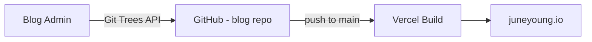
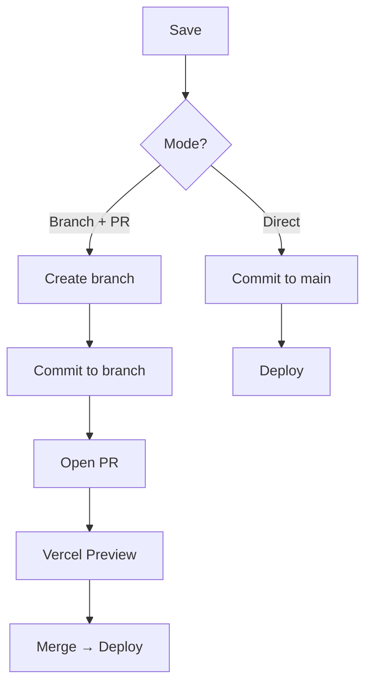

# Blog Admin

A self-hosted CMS for [juneyoung.io](https://juneyoung.io). Manages MDX content in the blog repo ([stevejkang/blog](https://github.com/stevejkang/blog)) via GitHub API.

## How It Works



Content changes (MDX + images) are committed atomically in a single commit. Push to `main` triggers Vercel auto-deploy.

## Publish Modes



Editing a post with an existing PR **amends** the commit (force push) — PR always stays at one commit.

## Setup

```bash
pnpm install
cp .env.example .env.local
```

| Variable | Description | Where to Get |
|----------|-------------|--------------|
| `AUTH_SECRET` | Session encryption key | `npx auth secret` |
| `AUTH_GITHUB_ID` | GitHub OAuth App Client ID | [Developer Settings](https://github.com/settings/developers) → OAuth Apps |
| `AUTH_GITHUB_SECRET` | GitHub OAuth App Client Secret | Same as above |
| `GITHUB_TOKEN` | Fine-grained PAT (Contents + PRs RW) | [Tokens](https://github.com/settings/tokens) → select `blog` repo |

OAuth callback URL: `http://localhost:3000/api/auth/callback/github`

```bash
pnpm dev
```
